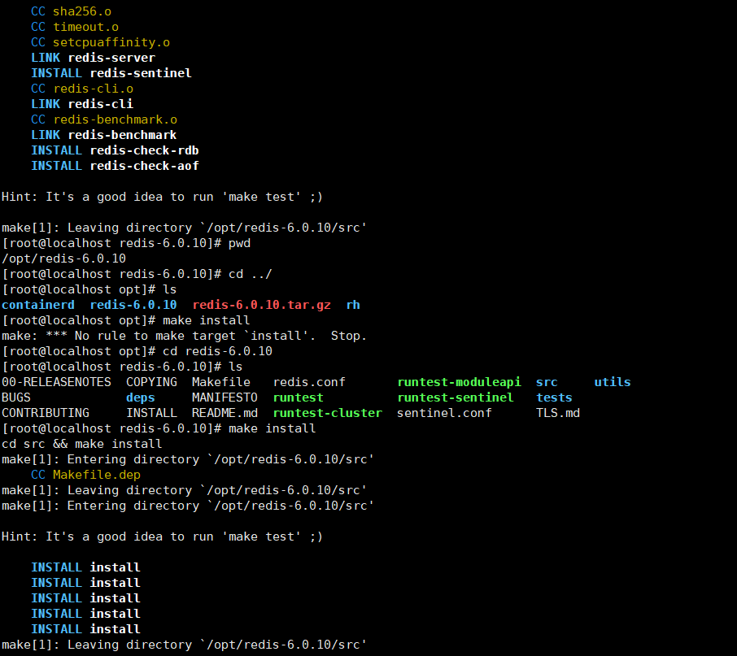
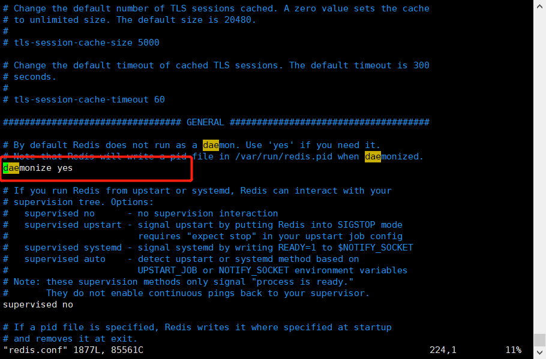
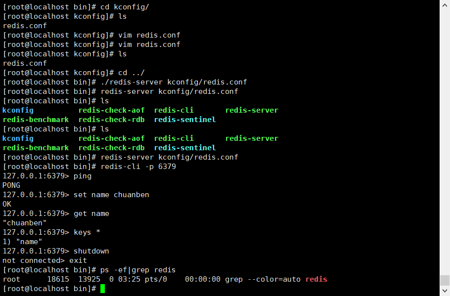
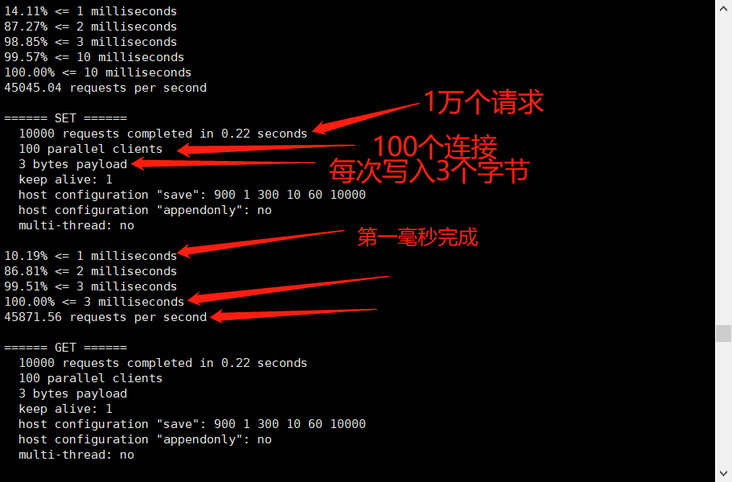

# Redis安装linux

## 1、官网下载tar安装包

https://redis.io/


## 2、将安装包上传到linux的opt目录

```shell
cd /opt/
```


## 3、安装gcc环境

```shell
yum -y install gcc-c++
```

## 4、升级gcc版本

```sh
#查看gcc的版本是否在 5.3以上，centos7默认是4.8.5.我这里的就是4.8.5
gcc -v

#升级到 5.3及以上版本
yum -y install centos-release-scl
yum -y install devtoolset-9-gcc devtoolset-9-gcc-c++ devtoolset-9-binutils

scl enable devtoolset-9 bash

#注意：scl命令启用只是临时的，推出xshell或者重启就会恢复到原来的gcc版本。如果要长期生效的话，执行如下：
echo "source /opt/rh/devtoolset-9/enable" >>/etc/profile

```

## 5、执行make

```shell
#步骤1
[root@localhost opt]# make
#步骤2
[root@localhost opt]# make install

```



## 6、redis默认安装路径

```shell
[root@localhost src]# cd /usr/local/bin/
[root@localhost bin]# ls
redis-benchmark  redis-check-aof  redis-check-rdb  redis-cli  redis-sentinel  redis-server

```

## 7、复制redis.conf到默认路径

```shell
[root@localhost bin]# mkdir kconfig
[root@localhost bin]# cp /opt/redis-6.0.10/redis.conf /usr/local/bin/kconfig/

```

## 8、修改redis后台启动

```shell
[root@localhost kconfig]# vim redis.conf
```



## 9、查看redis进程

```shell
[root@localhost bin]# ps -ef|grep redis
root      18365      1  0 03:01 ?        00:00:01 ./redis-server 127.0.0.1:6379
root      18377  13925  0 03:03 pts/0    00:00:00 redis-cli -p 6379
root      18590  18541  0 03:21 pts/1    00:00:00 grep --color=auto redis

```


## 10、通过指定配置文件启动服务

```shell
[root@localhost bin]# redis-server kconfig/redis.conf 

```

## 11、客户端连接redis服务

```shell
[root@localhost bin]# redis-cli -p 6379
127.0.0.1:6379> ping
PONG
127.0.0.1:6379> set name chuanben
OK
127.0.0.1:6379> get name
"chuanben"
127.0.0.1:6379> keys *
1) "name"
127.0.0.1:6379> 


```

## 12、关闭redis服务

```shell
127.0.0.1:6379> shutdown
not connected> exit
[root@localhost bin]# ps -ef|grep redis
root      18615  13925  0 03:25 pts/0    00:00:00 grep --color=auto redis
[root@localhost bin]# 
```




# redis-benchmark 性能测试

## 1、查看帮助命令

```shell
[root@localhost bin]# redis-benchmark --help
Usage: redis-benchmark [-h <host>] [-p <port>] [-c <clients>] [-n <requests>] [-k <boolean>]

 -h <hostname>      Server hostname (default 127.0.0.1)
 -p <port>          Server port (default 6379)
 -s <socket>        Server socket (overrides host and port)
 -a <password>      Password for Redis Auth
 --user <username>  Used to send ACL style 'AUTH username pass'. Needs -a.
 -c <clients>       Number of parallel connections (default 50)
 -n <requests>      Total number of requests (default 100000)
 -d <size>          Data size of SET/GET value in bytes (default 3)
 --dbnum <db>       SELECT the specified db number (default 0)
 --threads <num>    Enable multi-thread mode.
 --cluster          Enable cluster mode.
 --enable-tracking  Send CLIENT TRACKING on before starting benchmark.
 -k <boolean>       1=keep alive 0=reconnect (default 1)
 -r <keyspacelen>   Use random keys for SET/GET/INCR, random values for SADD,
                    random members and scores for ZADD.
  Using this option the benchmark will expand the string __rand_int__
  inside an argument with a 12 digits number in the specified range
  from 0 to keyspacelen-1. The substitution changes every time a command
  is executed. Default tests use this to hit random keys in the
  specified range.
 -P <numreq>        Pipeline <numreq> requests. Default 1 (no pipeline).
 -e                 If server replies with errors, show them on stdout.
                    (no more than 1 error per second is displayed)
 -q                 Quiet. Just show query/sec values
 --precision        Number of decimal places to display in latency output (default 0)
 --csv              Output in CSV format
 -l                 Loop. Run the tests forever
 -t <tests>         Only run the comma separated list of tests. The test
                    names are the same as the ones produced as output.
 -I                 Idle mode. Just open N idle connections and wait.

Examples:

 Run the benchmark with the default configuration against 127.0.0.1:6379:
   $ redis-benchmark

 Use 20 parallel clients, for a total of 100k requests, against 192.168.1.1:
   $ redis-benchmark -h 192.168.1.1 -p 6379 -n 100000 -c 20

 Fill 127.0.0.1:6379 with about 1 million keys only using the SET test:
   $ redis-benchmark -t set -n 1000000 -r 100000000

 Benchmark 127.0.0.1:6379 for a few commands producing CSV output:
   $ redis-benchmark -t ping,set,get -n 100000 --csv

 Benchmark a specific command line:
   $ redis-benchmark -r 10000 -n 10000 eval 'return redis.call("ping")' 0

 Fill a list with 10000 random elements:
   $ redis-benchmark -r 10000 -n 10000 lpush mylist __rand_int__

 On user specified command lines __rand_int__ is replaced with a random integer
 with a range of values selected by the -r option.

#翻译
[根@localhostbin]#redis benchmark—帮助
用法：redis benchmark[-h<host>][-p<port>][-c<clients>][-n<requests>][-k<boolean>]
-h<hostname>服务器主机名（默认127.0.0.1）
-p<port>服务器端口（默认6379）
-服务器套接字（覆盖主机和端口）
-Redis Auth的<password>密码
--用户<username>用于发送ACL样式的“AUTH username pass”。需要-a。
-c<客户端>并行连接数（默认值50）
-n<requests>请求总数（默认值100000）
-d<size>SET/GET值的数据大小（字节）（默认值3）
--dbnum<db>选择指定的db编号（默认为0）
--线程<num>启用多线程模式。
--群集启用群集模式。
--在启动基准测试之前启用跟踪发送客户端跟踪。
-k<boolean>1=保持活动0=重新连接（默认值1）
-r<keyspacelen>对SET/GET/INCR使用随机键，对SADD使用随机值，
ZADD的随机成员和分数。
使用此选项，基准将展开字符串\uu rand\u int__
在指定范围内具有12位数字的参数中
从0到keyspacelen-1。每次执行命令时替换都会更改
已执行。默认测试使用它来命中
指定范围。
-P<numreq>管道<numreq>请求。默认值1（无管道）。
-如果服务器回复有错误，则在标准输出上显示它们。
（每秒显示的错误不超过1个）
-q安静。只显示查询/秒值
--延迟输出中要显示的小数位数的精度（默认值为0）
--csv格式的csv输出
-我绕了一圈。永远运行测试
-t<tests>只运行逗号分隔的测试列表。测试
名称与作为输出生成的名称相同。
-我选择空闲模式。只需打开N个空闲连接并等待。
示例：
根据127.0.0.1:6379使用默认配置运行基准测试：
$redis基准
针对192.168.1.1，使用20个并行客户端，总共10万个请求：
$redis基准-h 192.168.1.1-p 6379-n 100000-c 20
仅使用SET测试用大约100万个键填充127.0.0.1:6379：
$redis基准-t集-n 1000000-r 100000000
基准127.0.0.1:6379对于一些产生CSV输出的命令：
$redis基准-t ping，set，get-n 100000--csv
对特定命令行进行基准测试：
$redis基准-r 10000-n 10000评估回报redis.呼叫（“ping”）'0
用10000个随机元素填充列表：
$redis基准-r 10000-n 10000 lpush mylist\uu rand\u int__
在用户指定的命令行上，rand int替换为随机整数
使用-r选项选择的值范围。
```

## 2、测试

```shell
#测试100个并发连接 10000个请求
[root@localhost bin]# redis-benchmark -h localhost -p 6379 -c 100 -n 10000

```



# 基础命令

## 1、选择数据库（默认有16个）

```shell
#默认使用第0个

#选择第3个数据库
127.0.0.1:6379> select 3

```

## 2、查看数据库大小

```shell
127.0.0.1:6379[3]> dbsize
(integer) 0

```

## 3、查看所有的key

```shell
127.0.0.1:6379> keys *
1) "name"
2) "counter:__rand_int__"
3) "mylist"
4) "myhash"
5) "key:__rand_int__"

```

## 4、清空数据库

```shell
#清空当前数据库
127.0.0.1:6379[3]> flushdb
OK

#清空所有数据库
127.0.0.1:6379> flushall
OK

```

# 五大数据类型


官方命令文档：https://redis.io/commands


## Redis-key

1、设置/获取 key值

```shell
#设置key值
127.0.0.1:6379> set key ben
OK

#获取key值
127.0.0.1:6379> get key
"name"
```

2、查看所有的key

```shell
127.0.0.1:6379> keys *
1) "key"

```


3、查看key是否存在

```shell
127.0.0.1:6379> exists key
(integer) 1

```

4、设置key的过期时间

```shell
127.0.0.1:6379> expire name 10
(integer) 1

```

5、查看过期时间

```shell
127.0.0.1:6379> ttl name
(integer) 5
127.0.0.1:6379> ttl name
(integer) 2

```

6、查看数据类型

```shell
127.0.0.1:6379> type key
string

```

## String(字符串)

```shell
set			#赋值
get			#取值
setnx		#不存在则添加，否则失败
setex		#赋值并修改有效时间
mset		#赋值多个
mget		#取值多个
strlen		#字符长度
getrange	#从指定位置开始取值
setrange	#从指定位置开始修改字符
append		#追加字符串
incr		#步长加
decr		#步长减
incrby		#指定步长加
decrby		#指定步长减
getset 		#先取值后赋值

#练习
127.0.0.1:6379> flushall
OK
127.0.0.1:6379> keys *
(empty array)
127.0.0.1:6379> set name v
OK
127.0.0.1:6379> get name
"v"
127.0.0.1:6379> mset name1 v1 name2 v2
OK
127.0.0.1:6379> mget name1 name2
1) "v1"
2) "v2"
127.0.0.1:6379> strlen name
(integer) 1
127.0.0.1:6379> append name b
(integer) 2
127.0.0.1:6379> get name
"vb"
127.0.0.1:6379> setrange name 1 qwerty
(integer) 7
127.0.0.1:6379> get name
"vqwerty"
127.0.0.1:6379> getrange name 3 6
"erty"
127.0.0.1:6379> setex name 100 v
OK
127.0.0.1:6379> ttl name
(integer) 96
127.0.0.1:6379> setnx name vnx
(integer) 0
127.0.0.1:6379> setnx namenx nx
(integer) 1
127.0.0.1:6379> msetnx name v name4 v4
(integer) 0
127.0.0.1:6379> msetnx name4 v4
(integer) 1
127.0.0.1:6379> set num 1
OK
127.0.0.1:6379> incr num
(integer) 2
127.0.0.1:6379> get num
"2"
127.0.0.1:6379> incrby num 5
(integer) 7
127.0.0.1:6379> get num
"7"
127.0.0.1:6379> decr num
(integer) 6
127.0.0.1:6379> get num
"6"
127.0.0.1:6379> decrby num 3
(integer) 3
127.0.0.1:6379> get num
"3"
127.0.0.1:6379> 


```

## list(列表)

```shell
lpush 	#链表左边增加数据
rpush	#链表右边增加数据
lrange 	#查看链表数据
ltirm	#截取指定链表区间
linsert #指定位置插入数据
lset	#修改指定位置数据
lpop	#删除链表左边一条数据
rpop	#删除链表右边一条数据
rpoplpush #取出链表右边一条数据放入新的链表
lrem	#根据数据值删除数据

#练习
127.0.0.1:6379> flushall
OK
127.0.0.1:6379> keys *
(empty array)
127.0.0.1:6379> lpush mylist v1
(integer) 1
127.0.0.1:6379> lpush mylist v2
(integer) 2
127.0.0.1:6379> lpush mylist v3
(integer) 3
127.0.0.1:6379> lrange mylist 0 -1
1) "v3"
2) "v2"
3) "v1"
127.0.0.1:6379> rpush mylist v4
(integer) 4
127.0.0.1:6379> rpush mylist v5
(integer) 5
127.0.0.1:6379> lrange mylist 0 -1
1) "v3"
2) "v2"
3) "v1"
4) "v4"
5) "v5"
127.0.0.1:6379> lpop mylist
"v3"
127.0.0.1:6379> lrange mylist 0 -1
1) "v2"
2) "v1"
3) "v4"
4) "v5"
127.0.0.1:6379> rpop mylist 
"v5"
127.0.0.1:6379> lrange mylist 0 -1
1) "v2"
2) "v1"
3) "v4"
127.0.0.1:6379> lset mylist 1 v5
OK
127.0.0.1:6379> lrange mylist 0 -1
1) "v2"
2) "v5"
3) "v4"
127.0.0.1:6379> rpush mylist v5
(integer) 4
127.0.0.1:6379> rpush mylist v4
(integer) 5
127.0.0.1:6379> lrange mylist 0 -1
1) "v2"
2) "v5"
3) "v4"
4) "v5"
5) "v4"
127.0.0.1:6379> lrem mylist 1 v4
(integer) 1
127.0.0.1:6379> lrange mylist 0 -1
1) "v2"
2) "v5"
3) "v5"
4) "v4"
127.0.0.1:6379> lrem mylist 2 v5
(integer) 2
127.0.0.1:6379> lrange mylist 0 -1
1) "v2"
2) "v4"
127.0.0.1:6379> rpush mylist v6
(integer) 3
127.0.0.1:6379> rpush mylist v7
(integer) 4
127.0.0.1:6379> lrange mylist 0 -1
1) "v2"
2) "v4"
3) "v6"
4) "v7"
127.0.0.1:6379> ltrim mylist 1 3
OK
127.0.0.1:6379> lrange mylist 0 -1
1) "v4"
2) "v6"
3) "v7"
127.0.0.1:6379> linsert mylist after v4 v5
(integer) 4
127.0.0.1:6379> lrange mylist 0 -1
1) "v4"
2) "v5"
3) "v6"
4) "v7"
127.0.0.1:6379> linsert mylist before v7 v8
(integer) 5
127.0.0.1:6379> lrange mylist 0 -1
1) "v4"
2) "v5"
3) "v6"
4) "v8"
5) "v7"
127.0.0.1:6379> rpoplpush mylist mylist2
"v7"
127.0.0.1:6379> keys *
1) "mylist"
2) "mylist2"
127.0.0.1:6379> lrange mylist 0 -1
1) "v4"
2) "v5"
3) "v6"
4) "v8"
127.0.0.1:6379> lrange mylist2 0 -1
1) "v7"

```


## Set

```shell
sadd	#添加数据，无序不重复
smembers	#查看集合
sismember	#查看集合元素是否存在
srandmember	#随机查看数据
srem	#删除指定元素
spop	#随机删除元素
sdiff	#差集
sinter	#交集
snuion	#并集

#练习
127.0.0.1:6379> flushdb
OK
127.0.0.1:6379> keys *
(empty array)
127.0.0.1:6379> sadd myset v1
(integer) 1
127.0.0.1:6379> sadd myset v2
(integer) 1
127.0.0.1:6379> sadd myset v3
(integer) 1
127.0.0.1:6379> smembers myset
1) "v2"
2) "v1"
3) "v3"
127.0.0.1:6379> sismember myset v2
(integer) 1
127.0.0.1:6379> sismember myset v4
(integer) 0
127.0.0.1:6379> srandmember myset 1
1) "v3"
127.0.0.1:6379> srandmember myset 1
1) "v3"
127.0.0.1:6379> srandmember myset 1
1) "v3"
127.0.0.1:6379> srandmember myset 1
1) "v1"
127.0.0.1:6379> srandmember myset 2
1) "v1"
2) "v3"
127.0.0.1:6379> srandmember myset 2
1) "v2"
2) "v3"
127.0.0.1:6379> srandmember myset 2
1) "v2"
2) "v3"
127.0.0.1:6379> smembers myset
1) "v2"
2) "v1"
3) "v3"
127.0.0.1:6379> spop myset 
"v3"
127.0.0.1:6379> srem myset v1
(integer) 1
127.0.0.1:6379> smembers myset
1) "v2"
127.0.0.1:6379> sadd myset v4
(integer) 1
127.0.0.1:6379> sadd myset v5
(integer) 1
127.0.0.1:6379> sadd myset v6
(integer) 1
127.0.0.1:6379> sadd myset2 v5
(integer) 1
127.0.0.1:6379> sadd myset2 v6
(integer) 1
127.0.0.1:6379> sadd myset2 v7
(integer) 1
127.0.0.1:6379> smembers myset
1) "v5"
2) "v2"
3) "v4"
4) "v6"
127.0.0.1:6379> smembers myset2
1) "v7"
2) "v5"
3) "v6"
127.0.0.1:6379> sdiff myset myset2
1) "v2"
2) "v4"
127.0.0.1:6379> sdiff myset2 myset
1) "v7"
127.0.0.1:6379> sinter myset myset2
1) "v5"
2) "v6"
127.0.0.1:6379> sinter myset2 myset
1) "v5"
2) "v6"
127.0.0.1:6379> sunion myset myset2
1) "v6"
2) "v2"
3) "v7"
4) "v5"
5) "v4"
127.0.0.1:6379> 

```


## Hash

```shell
hset 		#赋值
hmset		#多个同时赋值
hget		#取值
hmget		#同时取值多个
hgetall		#查看所有key和value
hkeys		#查看所有key
hvals		#查看所有value
hlen		#大小
hdel		#根据key删除
hincrby		#步长加
hdecrby		#步长减

#练习
127.0.0.1:6379> flushdb
OK
127.0.0.1:6379> keys *
(empty array)
127.0.0.1:6379> hset myhash  k v
(integer) 1
127.0.0.1:6379> hgetall myhash
1) "k"
2) "v"
127.0.0.1:6379> hmset myhash k1 v1 k2 v2 k3 v3
OK
127.0.0.1:6379> hmget myhash k1 k2 k3
1) "v1"
2) "v2"
3) "v3"
127.0.0.1:6379> hgetall myhash
1) "k"
2) "v"
3) "k1"
4) "v1"
5) "k2"
6) "v2"
7) "k3"
8) "v3"
127.0.0.1:6379> hkeys myhash
1) "k"
2) "k1"
3) "k2"
4) "k3"
127.0.0.1:6379> hvals myhash
1) "v"
2) "v1"
3) "v2"
4) "v3"
127.0.0.1:6379> hlen myhash
(integer) 4
127.0.0.1:6379> hdel myhash k2
(integer) 1
127.0.0.1:6379> hgetall myhash
1) "k"
2) "v"
3) "k1"
4) "v1"
5) "k3"
6) "v3"
127.0.0.1:6379> hset myhash1 num 5
(integer) 1
127.0.0.1:6379> hincrby myhash1 num 2
(integer) 7
127.0.0.1:6379> hgetall myhash1
1) "num"
2) "7"
127.0.0.1:6379> 

```


## Zset

```shell
zadd 			#添加元素
zrange			#从小到大查看元素
zrevrange		#从大到小查看元素
zrangebyscore	#查看元素和分值
zrem			#删除元素
zcount			#按分值区间统计
zcard			#集合大小

#练习
127.0.0.1:6379> flushdb
OK
127.0.0.1:6379> keys *
(empty array)
127.0.0.1:6379> zadd myzset 1 v1 29 v2 15 v3 6 v4 17 v8 
(integer) 5
127.0.0.1:6379> zrange myzset 0 -1
1) "v1"
2) "v4"
3) "v3"
4) "v8"
5) "v2"
127.0.0.1:6379> zrevrange myzset 0 -1
1) "v2"
2) "v8"
3) "v3"
4) "v4"
5) "v1"
127.0.0.1:6379> zrangebyscore myzset -inf +inf withscores
 1) "v1"
 2) "1"
 3) "v4"
 4) "6"
 5) "v3"
 6) "15"
 7) "v8"
 8) "17"
 9) "v2"
10) "29"
127.0.0.1:6379> zcard myzset
(integer) 5
127.0.0.1:6379> zcount myzset 0 6
(integer) 2
127.0.0.1:6379> zcount myzset 1 100
(integer) 5
127.0.0.1:6379> zcount myzset 1 19
(integer) 4
127.0.0.1:6379> zrem myzset v1
(integer) 1
127.0.0.1:6379> zrange myzset 0 -1
1) "v4"
2) "v3"
3) "v8"
4) "v2"

```


# 三种特殊数据类型

## geospatial

```shell
geoadd	#添加坐标
geopos	#查看坐标
geodist	#计算距离
georadius	#根据经纬度查看范围内key
georadiusbymember	##根据key名 查看范围内目标
geohash	#计算坐标hash值 

withdist	#还要返回指定中心返回物品的距离。
withcoord #还返回匹配项目的经度，纬度坐标。

#练习
127.0.0.1:6379> flushdb
OK
127.0.0.1:6379> keys *
(empty array)
127.0.0.1:6379> geoadd china:city 113.23 23.16  guangzhou 
(integer) 1
127.0.0.1:6379> geoadd china:city 116.46 39.92 beijing
(integer) 1
127.0.0.1:6379> geoadd china:city 108.33 22.84 nanning
(integer) 1
127.0.0.1:6379> geoadd china:city 117 36.65 jinan
(integer) 1
127.0.0.1:6379> geoadd china:city 121.48 31.22 shanghai
(integer) 1

127.0.0.1:6379> geopos china:city beijing
1) 1) "116.45999997854232788"
   2) "39.9199990416181052"
127.0.0.1:6379> geopos china:city shanghai
1) 1) "121.48000091314315796"
   2) "31.21999956478423854"
   
127.0.0.1:6379> geodist china:city beijing shanghai
(nil)
127.0.0.1:6379> geodist china:city beijing shanghai km
(nil)
127.0.0.1:6379> geodist china:city beijing shanghai km
"1068.4581"
127.0.0.1:6379> geodist china:city beijing nanning km
"2048.2591"

127.0.0.1:6379> georadiusbymember china:city beijing 1000 km
1) "jinan"
2) "beijing"
127.0.0.1:6379> georadiusbymember china:city beijing 2000 km
1) "guangzhou"
2) "shanghai"
3) "jinan"
4) "beijing"

127.0.0.1:6379> georadius china:city 114.48 38.03 1000 km
1) "jinan"
2) "beijing"
3) "shanghai"
127.0.0.1:6379> georadius china:city 114.48 38.03 2000 km
1) "nanning"
2) "guangzhou"
3) "shanghai"
4) "jinan"
5) "beijing"

127.0.0.1:6379> geohash china:city beijing
1) "wx4g455wfe0"
127.0.0.1:6379> geohash china:city beijing shanghai
1) "wx4g455wfe0"
2) "wtw3s77j9j0"


127.0.0.1:6379> zrange china:city 0 -1
1) "nanning"
2) "guangzhou"
3) "shanghai"
4) "jinan"
5) "beijing"

127.0.0.1:6379> zcard china:city
(integer) 5

```


## hyperloglog

```shell
pfadd	#添加元素
pfcount	#统计不相同的元素
pfmerge	#合并为新的hyperloglog

#练习
127.0.0.1:6379> flushdb
OK
127.0.0.1:6379> keys *
(empty array)
127.0.0.1:6379> pfadd mykey a b  c d e f g 
(integer) 1
127.0.0.1:6379> pfadd mykey2 f g h i j k l  m n 
(integer) 1
127.0.0.1:6379> pfcount mykey
(integer) 7
127.0.0.1:6379> pfcount mykey2
(integer) 9
127.0.0.1:6379> pfmerge mykey3 mykey mykey2
OK
127.0.0.1:6379> pfcount mykey3
(integer) 14

#允许重复，但是统计会忽略相同元素，且有0.81%概率错误
127.0.0.1:6379> pfadd mykey4 a b c a
(integer) 1
127.0.0.1:6379> pfcount mykey4
(integer) 3
127.0.0.1:6379> 
127.0.0.1:6379> pfadd mykey4 e
(integer) 1
127.0.0.1:6379> pfcount mykey4
(integer) 4

```


## bitmaps

```shell
setbit	#添加位图元素
getbit	#查看位图元素
bitcount	#统计元素为1的数量

#练习
127.0.0.1:6379> flushdb
OK
127.0.0.1:6379> keys *
(empty array)
127.0.0.1:6379> setbit mykey 0 1
(integer) 0
127.0.0.1:6379> setbit mykey 1 0
(integer) 0
127.0.0.1:6379> setbit mykey 2 1
(integer) 0
127.0.0.1:6379> setbit mykey 3 1
(integer) 0
127.0.0.1:6379> setbit mykey 4 0
(integer) 0
127.0.0.1:6379> setbit mykey 5 0
(integer) 0
127.0.0.1:6379> setbit mykey 6 1
(integer) 0
127.0.0.1:6379> getbit mykey 5
(integer) 0
127.0.0.1:6379> getbit mykey 6
(integer) 1
127.0.0.1:6379> bitcount mykey
(integer) 4
127.0.0.1:6379> 
```

# 事务和乐观锁

```shell
multi	#开启事务
exec	#执行事务
discard	#放弃事务

wacth	#监控key是否发生变化，开启乐观锁

#练习
127.0.0.1:6379> flushdb
OK
127.0.0.1:6379> multi
OK
127.0.0.1:6379> set money 1000
QUEUED
127.0.0.1:6379> set out 0
QUEUED
127.0.0.1:6379> exec
1) OK
2) OK
127.0.0.1:6379> get money
"1000"
127.0.0.1:6379> watch money
OK
127.0.0.1:6379> multi 
OK
127.0.0.1:6379> decrby money 100
QUEUED
127.0.0.1:6379> incrby out 100
QUEUED
127.0.0.1:6379> exec
(nil)
127.0.0.1:6379> get money
"1100"
127.0.0.1:6379> multi 
OK
127.0.0.1:6379> decrby money 100
QUEUED
127.0.0.1:6379> incrby out 100
QUEUED
127.0.0.1:6379> exec
1) (integer) 1000
2) (integer) 100
127.0.0.1:6379> unwatch
OK
127.0.0.1:6379> unwatch
OK
127.0.0.1:6379> watch money
OK
127.0.0.1:6379> incrby money 500
(integer) 1700
127.0.0.1:6379> multi 
OK
127.0.0.1:6379> decrby money 300
QUEUED
127.0.0.1:6379> incrby out 300
QUEUED
127.0.0.1:6379> exec
(nil)
127.0.0.1:6379> multi
OK
127.0.0.1:6379> decrby money 300
QUEUED
127.0.0.1:6379> incrby out 300
QUEUED
127.0.0.1:6379> exec
1) (integer) 1400
2) (integer) 400

```

# Jedis